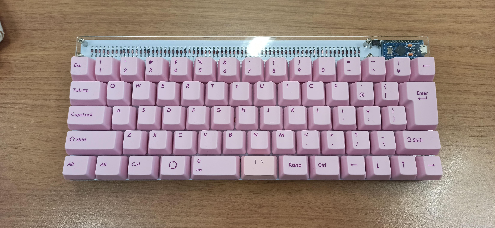

# kana60

[](https://cadlab.io/project/23636)

JP layout 60% mechanical keyboard

<p align="center">
  
</p>

Keycaps: [FILCO FKCS108NMP](https://www.amazon.co.jp/dp/B07SR3NHXY/) and another 1 keycap (At bottom of N key).

## How to verify checksums

```console
$ ls -1
kana60-acrylic-plates.zip
kana60-sha256sum.txt
kana60-top-plate.zip
kana60.zip
$ shasum --check kana60-sha256sum.txt
kana60-acrylic-plates.zip: OK
kana60.zip: OK
kana60-top-plate.zip: OK
```

## How to release

remove dist files:

```console
$ make clean
```

generate some files:

- open `kana60.kicad_pcb` and generate gerber files and drill files, via: `plot...`
- open `kana60-top-plate.kicad_pcb` and generate gerber files and drill files, via: `plot...`
- open `kana60-acrylic-plates.kicad_pcb` and generate PDF files, via: `plot...`

generate zip files and checksum file:

```console
$ make build create_checksum
```

verify zip files:

```console
$ make info
zipinfo dist/kana60-acrylic-plates/kana60-acrylic-plates.zip
Archive:  dist/kana60-acrylic-plates/kana60-acrylic-plates.zip
Zip file size: 22152 bytes, number of entries: 2
-rw-r--r--  3.0 unx     3150 bx defN 19-Oct-27 17:44 kana60-acrylic-plates-main.pdf
-rw-r--r--  3.0 unx    20236 bx defN 19-Oct-27 17:44 kana60-acrylic-plates-dimensions.pdf
2 files, 23386 bytes uncompressed, 21742 bytes compressed:  7.0%
zipinfo dist/kana60/kana60.zip
Archive:  dist/kana60/kana60.zip
Zip file size: 455650 bytes, number of entries: 9
-rw-r--r--  3.0 unx   807098 tx defN 19-Oct-27 17:44 kana60.GBL
-rw-r--r--  3.0 unx   293239 tx defN 19-Oct-27 17:44 kana60.GBS
-rw-r--r--  3.0 unx    49400 tx defN 19-Oct-27 17:44 kana60.GBO
-rw-r--r--  3.0 unx      980 tx defN 19-Oct-27 17:44 kana60.GML
-rw-r--r--  3.0 unx   522285 tx defN 19-Oct-27 17:44 kana60.GTL
-rw-r--r--  3.0 unx   293239 tx defN 19-Oct-27 17:44 kana60.GTS
-rw-r--r--  3.0 unx    88481 tx defN 19-Oct-27 17:44 kana60.GTO
-rw-r--r--  3.0 unx     4210 tx defN 19-Oct-27 17:44 kana60-NPTH.TXT
-rw-r--r--  3.0 unx    11536 tx defN 19-Oct-27 17:44 kana60.TXT
9 files, 2070468 bytes uncompressed, 454286 bytes compressed:  78.1%
zipinfo dist/kana60-top-plate/kana60-top-plate.zip
Archive:  dist/kana60-top-plate/kana60-top-plate.zip
Zip file size: 93042 bytes, number of entries: 9
-rw-r--r--  3.0 unx   201454 tx defN 19-Oct-27 17:44 kana60-top-plate.GBL
-rw-r--r--  3.0 unx     5359 tx defN 19-Oct-27 17:44 kana60-top-plate.GBS
-rw-r--r--  3.0 unx    11104 tx defN 19-Oct-27 17:44 kana60-top-plate.GBO
-rw-r--r--  3.0 unx    19886 tx defN 19-Oct-27 17:44 kana60-top-plate.GML
-rw-r--r--  3.0 unx   201454 tx defN 19-Oct-27 17:44 kana60-top-plate.GTL
-rw-r--r--  3.0 unx     5359 tx defN 19-Oct-27 17:44 kana60-top-plate.GTS
-rw-r--r--  3.0 unx      506 tx defN 19-Oct-27 17:44 kana60-top-plate.GTO
-rw-r--r--  3.0 unx      296 tx defN 19-Oct-27 17:44 kana60-top-plate-NPTH.TXT
-rw-r--r--  3.0 unx      388 tx defN 19-Oct-27 17:44 kana60-top-plate.TXT
9 files, 445806 bytes uncompressed, 91498 bytes compressed:  79.5%
```

push tag to GitHub and create Release:

```console
$ git tag 1.0
$ git push origin 1.0
```

upload files:

- kana60-acrylic-plates.zip
- kana60-sha256sum.txt
- kana60-top-plate.zip
- kana60.zip

## License

The MIT license.
